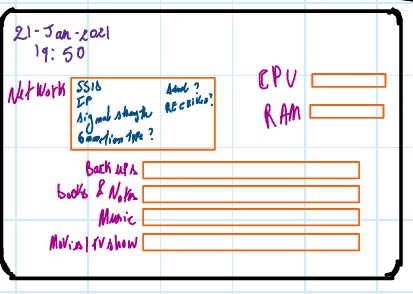
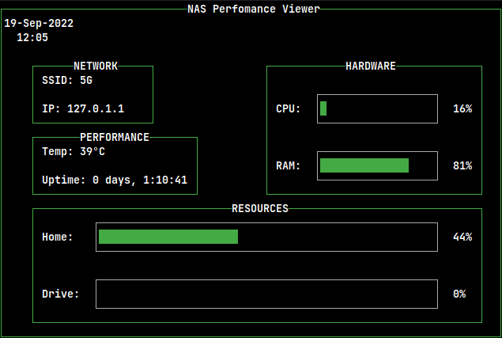
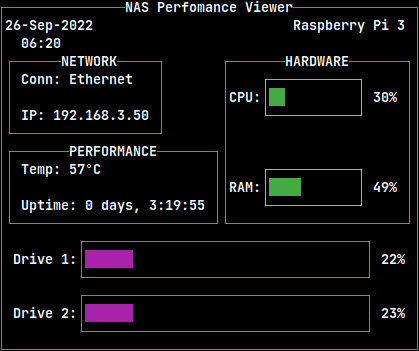

# NAS Performance Viewer (NPV)

A Terminal User Interface (TUI) for Linux Servers (NAS) that displays basic user information.
It monitors CPU and RAM usage, and the fullness of the installed disk drives.

Every project, small or big, starts with the initial sketch.

Somewhat of a final product:

On Running on Raspberry Pi 3 Model B Rev 1.2
Tested also on Raspberry Pi 4

# To do

- [x] Display Network info.  
- [x] Display Performance - Temperature and Uptime.  
- [x] Display Hardware info - CPU and RAM.  
- [x] Display Disk Drive info.  

## Needed Improvements

- [x] Display current working system.  
- [x] Resize - fit content within the [Adafruit 2.8" TFT Display](https://learn.adafruit.com/adafruit-2-8-tft-touch-shield-v2)  
- [x] Display Network info for either when Ethernet or WLAN is connected with the correct IP.  